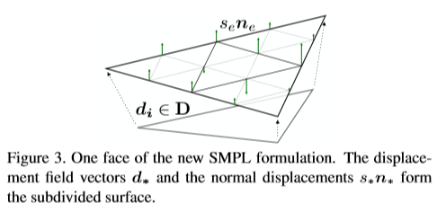

# Video Based Recondstruction of 3D People Models

## 1. Introduction

一种获取3D人体模型的方式是使用许多 active scanners ，但是这种方式十分昂贵，难以投入实际使用。或者可以从许多静态的身体姿态图片中进行 multiview passive reconstruction。然而人们一般难以保持长时间静止不动，因此这种处理方式十分耗时且容易出错。也可以使用 RGB-D相机来扫描3D人体模型，但是这种特殊的设备使用并不广泛。而我们提出的方法使用 RGB 视频来自动生成3D人体模型。

目前虽然在 重建3D人体模型 和 利用深度数据（点到传感器的距离，这里就是像素点到摄像头的距离）得到 free-form surface 这两方面有许多成果，但是如何在 monocular video 中得到穿着衣服的人的 3D 人体模型未被提出。目前有一些方法，能够从单张图片中得到大致的参数化的身体模型，并不能得到 personalized 的形状细节以及衣服的形状。

为了从视频中获得形状，我们可以联合起来优化以得到一个 free-form shape ，使它能满足 F 种图片。但不幸的是，这种方式需要一次优化 F 种姿势，内存里要存 F 个模型，这是十分不切实际的。


我们的方法的主要思想是生成人物的可见外壳（which is a bounding geometry of the actual 3D object）。获取可见外壳的传统方法是从多视角获取静态形状。每一个经过轮廓上的点的 camera ray 都是约束 3D 人体模型的线。如上图所示。为了得到 monocular video 中移动的人的可见外壳，首先要把他的动作去掉，得到一个标准的帧。首先穿着衣服的人体的形状用 SMPL 人类裸体的标准 T-pose模型表示（衣服的形状在模型中作为误差被表示）。首先，我们通过将 SMPL 模型适配到 2D detections 中，估计每一帧的初始身体形状和 3D 姿势[37,7]。有了这一步适配，我们将每一帧的每一个二维轮廓点 同人体模型中的三维点联系在一起。然后我们将每个投影光线使用 对应三维模型中的点的 inverse deformation model 作变换，这一步被称为 Unposing


把所有帧都做完 unposing 之后，我们就能得到标准 T-pose 模型。然后优化身体形状参数以及 free-form vertex displacements，以缩小三维模型点和 unposed rays 之间的距离。因此，我们只需要优化 a single displacement surface on top of SMPL 使它尽量接近于每一帧的内容，内存里只需要存储一个模型。


## 3. Method

利用一个 monocular RGB video 生成人的三维模型——身体、头发和衣服的形状，纹理映射和骨骼。我们的方法主要分三步：
- step 1: pose reconstruction
- step 2: consensus shape estimation
- step 3: frame refinement and texture map generation

我们的工作主要是 step 2。step 1 主要是之前的工作，step 3 是不必要的。

首先在 step 1 计算每一帧的三维姿势，我们拓展了 [7] 的方法；step 2 中计算 consensus shape，要尽量优化 consensus shape 来让它更符合每一帧中的人；step 3 中用 sliding window 方法优化每一帧的误差。

### 3.1 SMPL Body Model with Offsets

SMPL 是一个参数化的人类裸体模型，`M(β, θ)`。 输入 shape 参数 β，3D joints angles 参数 θ，输出 human mesh。

https://www.jianshu.com/p/5af622db58d4 

```
M(β, θ) = W( T(β, θ), J(β), θ, W)
T(β, θ) = T_μ + B_S(β) + B_P(θ)
```

将上述模型修改为下式。D 为 offset。

```
T(β, θ, D) = T_μ + B_S(β) + B_P(θ) + D
```

这个 offset D 能够更好地衡量模型细节和衣服，在 step 2 中会优化这个 offset


### 3.2 Step 1: Pose Reconstruction

首先初始化一个 base_smpl 模型，并从视频中取五帧。根据视角等参数，逐帧训练，调整 base_smpl 的参数，使它能够尽量接近每帧里面人的形状。

使用五帧训练得到一个粗糙的 beta 模型。然后对整个视频逐帧训练，优化这个smpl模型。

最终存储 SMPL 模型的 trans pose 和 beta 数据到 reconstructed_poses.hdf5

camera.pkl + keypoints.hdf5 + masks.hdf5 =>reconstructed_poses.hdf5

### 3.3 Step 2: Consensus Shape
SMPL 模型中，人体网格模型中的顶点 vi 可由参数 β θ 得到。（具体公式见论文）

根据该公式，可以得到每个 vi 对应的 ray r 的公式


看 Fig 3，有了每个顶点对应的ray r 之后，可以 unpose the silhouette cone
 并且限制标准 T 型模型。使用 unposing 的方法可以避免 blend-shape 的计算，显著减少内存使用.

我们的目标是优化下式

```
E_cons = E_data + w_lp*E_lp + w_var*E_var + w_sym*E_sym
```

在给定形状参数 β (`model_template.betas`) 和 vertex offset D (`base_smpl.v_personal`) 下，最小化上式。目标 E_cons 由数据项 E_data 和正则项 E_lp, E_var, E_sym 组成(每个正则项各有一个 w_* 权重参数)。

- **E_data: Data Term**
    - 衡量三维模型中顶点与 rays 之间的距离的项。
    - 

- **E_lp: Laplacian Term**
    - Smooth deformation

- **E_var: Body Model Term**
    - 对于 reconstructed free-form vertices v(β_0, D)

- **E_sym: Symmetry Term**
    - 人类一般是关于Y轴对称的

camera.pkl + masks.hdf5 + reconstructed_poses.hdf5 => consensus.obj + consensus.pkl

### 3.4 Step 3: Frame Refinement and Texture Generation

consensus.pkl + camera.pkl + masks.hdf5 + reconstructed_poses.hdf5 => texture.jpg


# Detailed Human Avatars from MonocularVideo

## 1. Introduction

我们使用 SMPL 获得人的姿势；然后将 an inverse pose transformation 应用于每一帧的 projection rays and normal fields，得到一个标准 T-pose；最后 optimize a high-resolution shape regularized by SMPL

与之前的工作主要有四点不同
- Facial landmarks
    - 脸部是模型重要的一部分，我们在三维模型重建时使用了二维 facial landmark detections。为了健壮性，我们将 landmark projection rays 变换到了 joint T-pose 的空间上
- Illumination and shape-from-shading
    - 利用灰度图片的亮度信息，根据亮度生成原理，求得每个像素在3D空间中的法向量，根据法向量球的深度信息 depth data。Shading 能够使生成的模型具有皱纹等细节。事实上大部分 shape-from-shading 方法也都是为了让静态物体具有更多细节。我们在此对每一帧做 shape-from-shading，获取逐帧的 partial 3D normal fields，结果将被变换至 T-pose 空间。
- Efficient texture stitching
    - 对于移动中的物体如何从多视角进行无缝的纹理拼接是很难的。需要把RGB值赋给每个纹理的像素点上，同时保证空间上的 smoothness。我们使用了一种新的方式叫 texture update energy function
- Semantic textur stitching
    - 除了纹理拼接，还有一个问题使 texture spilling。比如衣服的纹理可能会渲染到皮肤的区域中。为了减小这种溢出，我们为 texture update energy 添加了一个语义项。当某个像素点上的RGB值不太像这块区域的时候，这个语义项会给予惩罚。这个语义项显著的减少了溢出问题，并且有助于同一块区域的颜色尽量接近

## 3. Method


### 3.1. SubdividedSMPLbodymodel 

原始 SMPL 模型

```
M(β,θ,D) = W(T(β,θ,D),J(β),θ,W) (1) 
T(β,θ,D) = T + B_s(β) + B_p(θ) + D (2)
```



为了得到更细致的模型，将原始 SMPL 模型细化。如 Fig 3 所示，原本三个点构成的三角形网格，两两之间取中点后加一个偏置项得到新的点。

```
v_(N+e) = 0.5(v_i + v_j) + s_e*n_e

// 对于点对 v_i 和 v_j，n_e 是两点的法向量的平均向量；s_e 则是在 n_e 方向上的位移
```
得到新模型 `M_f(β,θ,D,s)`。 这样的新模型中 n_e 在初始化时就计算得到，s_e ∈ s 为参数。

而 s 由下式计算得到


### 3.2. Medium-levelbodyshapereconstruction 
